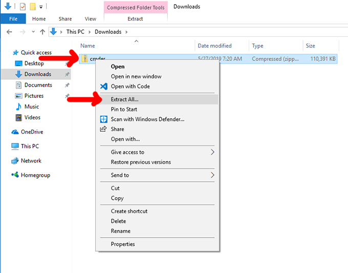
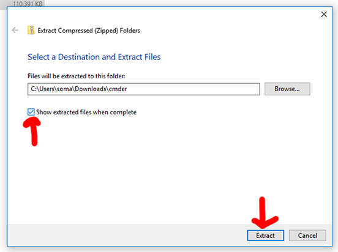
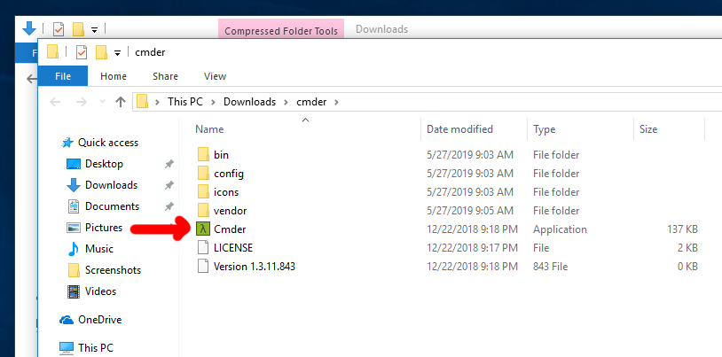
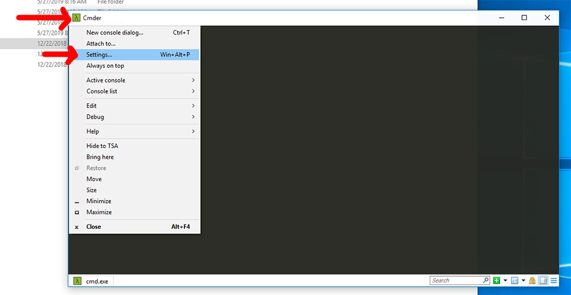
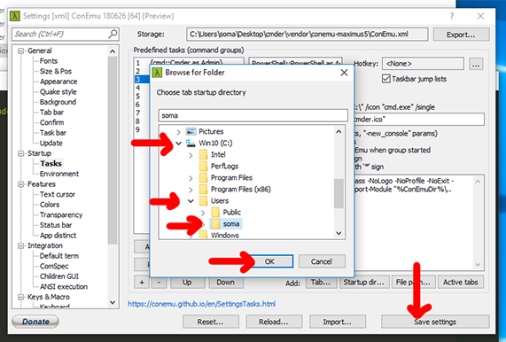
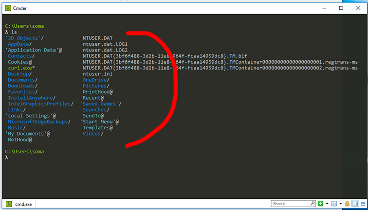
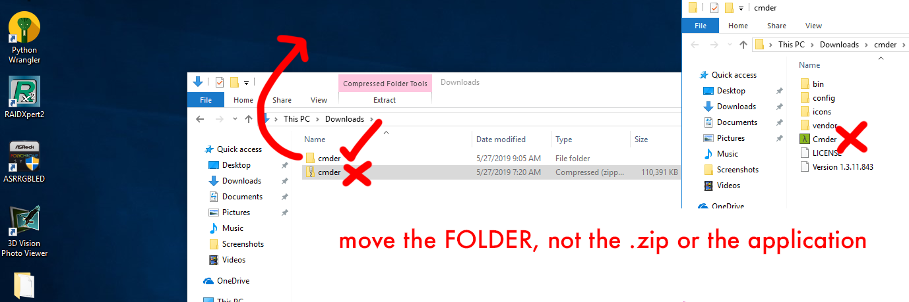

# Installing Cmder

!!! warning

    Cmder is for *Windows users only*.

## Installing

You'll want to download Cmder from [cmder.net](https://cmder.net/). **Be sure to download the Full Version**.

Once you've downloaded Cmder, **right-click Cmder.zip and click Extract All** to extract all of the files. When the extract menu comes up, check the box that says **Show extracted files when complete**. This saves us from having to double-click the folder it makes (I’m lazy, you're lazy, we're all lazy!)

When extraction is complete, you can run the `Cmder` file by double-clicking it.

Now that we have it open, we're going to change some settings to make it perfect and nice and useful.

## Setting up Cmder

Click the top-left corner of the Cmdr window, and select **Settings**.

Now jump through a few steps:

1. On the left-hand side, look under **Startup** and click **Tasks**
2. Select `{cmd::Cmder}` on the left hand side
3. Check the box for **Default task for new console**
4. Click **Startup dir…**

We’re going to find our "home directory," which is the directory with our name on it. Mine is in `C:\Users\soma\`, yours is probably somewhere similar. After you’ve clicked it, select OK and then Save settings.

**Now close Cmder, and open it again.**

If everything went well, you’ll see your home directory listed. See how mine is `C:\Users\soma`? And if you type `ls` and press enter, you’ll see a list of files and folders, including `Downloads` and `Documents`. If it doesn’t work, make sure you closed Cmder and opened it again.

## Installing Cmder somewhere nice

Keeping Cmder in our Downloads folder seems kind of weird, so let’s move it somewhere more convenient. I’m moving it to the **Desktop**, but you can put it anywhere you think is good. Just don't put it in **Program Files**, because Cmder hates spaces!

> Make sure you are using the cmder directory. Do not move the Cmder application or `cmder.zip`.

