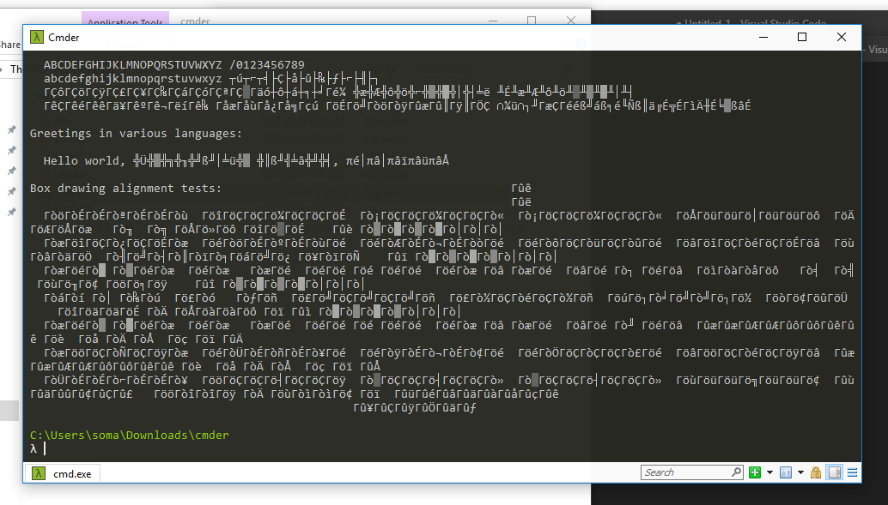
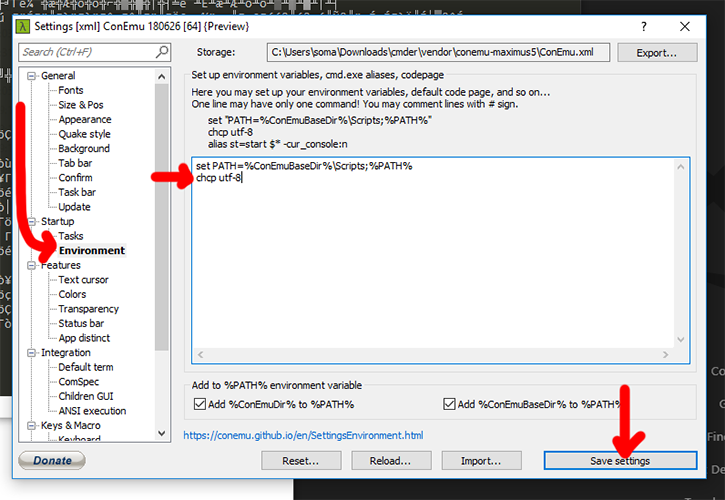

# Enabling UTF-8 support on the command line

When we're using the command line, we might assume that we can type just about anything. We might want to type things like:

* cupcakes
* crème brûlée
* アイスクリーム
* шоколад
* 🍩🍩🍩

That's freedom, right? But it turns out *you probably can't type all of those things!*

Your computer might be only set up for English text, or maybe it doesn't like accent marks or Japanese, or maybe 🍰 or 🍦 or 🍭 are just too much for it to handle!

Computers that only really understand English and Western European languages are set up with something called **Latin-1**, which is a very short list of characters that can be displayed. To make sure our command line can understand (and display) all text around the world – plus emoji – we're going to set up a super long list of characters **UTF-8**.

## Setting up UTF-8 support on OS X

OS X by default supports UTF-8 in the command line. But… sometimes it doesn’t? So we’ll add a few commands that will run every time you start the shell that forces UTF-8.

> **For the commands below:** if you’re typing instead of cutting and pasting, make sure you use `>>` — two greater-than symbols — not `»`. Also, be sure to hit enter after pasting in the second line.

To start, type `echo $SHELL` and press enter. If it says `/bin/zsh` run the following command:

```bash
echo 'export LC_ALL=en_US.UTF-8' >> ~/.zshrc
echo 'export LANG=en_US.UTF-8' >> ~/.zshrc
```

But it says `/bin/bash` run the following commands:

```bash
echo 'export LC_ALL=en_US.UTF-8' >> ~/.bash_profile
echo 'export LANG=en_US.UTF-8' >> ~/.bash_profile
```

If you do it right, it won’t say anything. But I promise it worked!

## Setting up UTF-8 support on Cmder in Windows

To see why we need UTF-8 support on Cmder in Windows, run this command from the command line:

```bash
curl https://www.cl.cam.ac.uk/~mgk25/ucs/examples/UTF-8-demo.txt
```

Ugly, right? Let's fix it!



Open up **Settings** again by clicking on the top left-hand corner of the Cmder window and going to **Startup > Environment**.

In the big box, add a new line that includes the following:

```bash
chcp utf-8
```

Once that's done, save your settings.



To test that it worked, open up a **new Cmder window** and run the command again:

```bash
curl https://www.cl.cam.ac.uk/~mgk25/ucs/examples/UTF-8-demo.txt
``` 


Nice and fun, right? That's the beauty of UTF-8!
